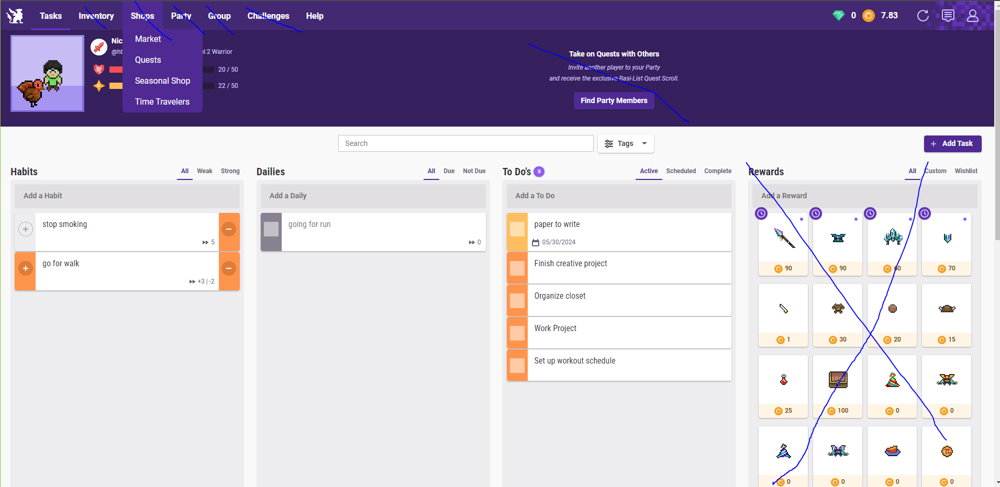

# group_project
crud

1. profile
    - create an account
    - edit account
    - view account
    - delete account

2. habits
    -
    -

3. dailies
    - reset everyday

4. to do's
    - goals setup for the day
    -

stretch goals

1. rewards

2. custom avatars

3. Level Up
    - Users should be able to gain experience by completing tasks.
    - Users should be able to level up and see their level change.
    - consecutive multiplyer for daily streak

User Avatars
Users should be able to view their custom avatar.
Users should be able to create their custom avatar.
Users should be able to edit their custom avatar.
Users should be able to delete their custom avatar.

Habits
Users should be able to view their created habits.
Users should be able to create new habits.
Users should be able to update their habits.
Users should be able to delete their habits.

Dailies
Users should be able to view their created dailies.
Users should be able to create new dailies.
Users should be able to update their dailies.
Users should be able to delete their dailies.

To-dos
Users should be able to view their created to-dos.
Users should be able to create new to-dos.
Users should be able to update their to-dos.
Users should be able to delete their to-dos.

Bonus: Level Up
Users should be able to gain experience by completing tasks.
Users should be able to level up and see their level change.
